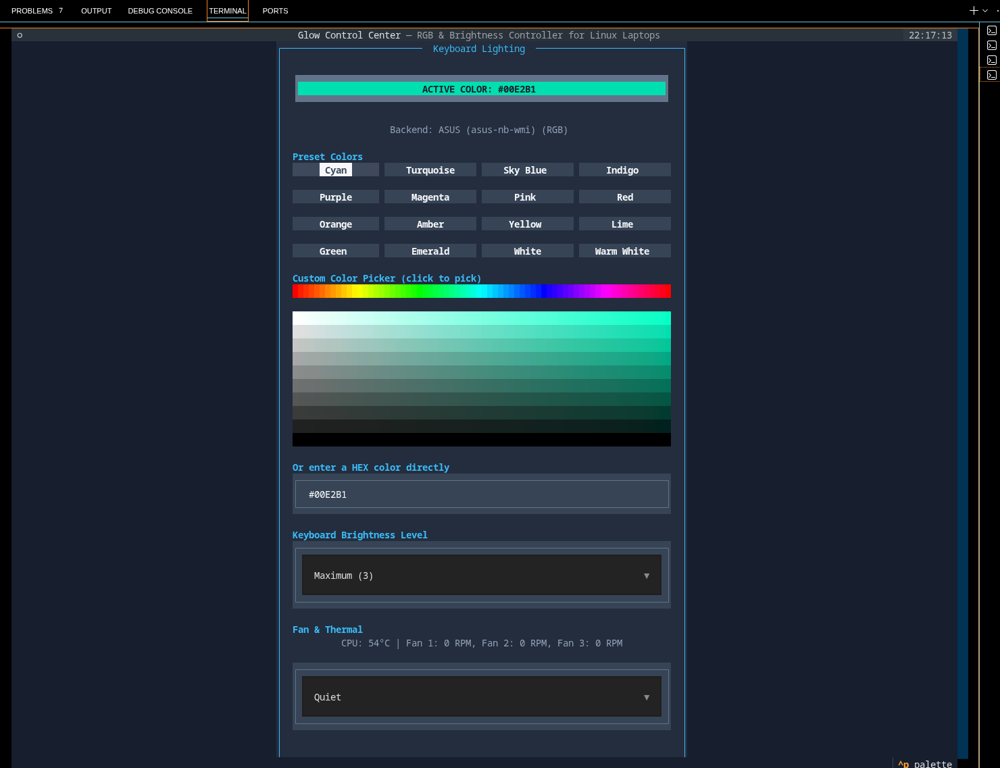

# global-Glow-RGB 🌈

A lightweight Terminal User Interface (TUI) for controlling the RGB keyboard backlight, brightness and fan/thermal profile on Linux laptops.

Originally built for ASUS TUF Gaming laptops, it now auto-detects the best available backend so it also works on other vendors (e.g. Acer Predator/Nitro via OpenRGB, and generic brightness-only backlights on many Dell/HP/Lenovo models).

Built with **Python** and **Textual**.

---

## ✨ Features

- 🎨 16 preset RGB colors
- 🖱️ Full HSV color picker — click a hue, then click anywhere in the grid for the exact shade
- 🌈 Custom HEX color input
- 💡 Keyboard brightness control
- 🌀 Fan/thermal profile control (Quiet / Balanced / Performance) — cross-vendor via the kernel's ACPI platform-profile interface
- 🌡️ Live CPU temperature & fan RPM readout
- 💾 Remembers your last color, brightness and fan profile between launches
- ⚙️ Headless `--apply` mode to restore settings on boot/login without opening the UI
- 🖥️ Modern terminal interface
- 🔒 Automatic privilege request with `pkexec`
- 🐧 Native Linux support, multi-vendor hardware detection

---

## 📸 Screenshot



---

## 📋 Requirements

- Linux
- Python 3.10+
- `pkexec`
- `textual` (pulls in `rich` automatically)
- Optional: [`openrgb`](https://openrgb.org) installed for non-ASUS RGB keyboards

---

## 🚀 Installation

Clone the repository:
```bash
git clone https://github.com/alidagdelen/tuf-glow-rgb.git
cd tuf-glow-rgb
```

Create a virtual environment (recommended):
```bash
python3 -m venv .venv
source .venv/bin/activate
```

Install dependencies:
```bash
pip install -r requirements.txt
```

Run the application:
```bash
python3 main.py
```

The app re-launches itself with `pkexec` to get the root privileges needed to write to `sysfs`. If `pkexec`/polkit isn't installed, run it with `sudo` instead.

---

## 🎮 Controls

| Action | Description |
|--------|-------------|
| Color Buttons | Apply preset RGB colors |
| Hue Bar + Grid | Pick any color from the full spectrum |
| HEX Input | Apply any custom RGB color |
| Brightness Select | Change keyboard brightness |
| Fan Profile Select | Switch between Quiet / Balanced / Performance |
| Ctrl + C | Exit the application |

---

## 🧩 Supported Hardware

### Keyboard RGB / brightness
| Backend | Coverage | Requirements |
|---|---|---|
| ASUS (`asus-nb-wmi`) | ASUS TUF, ROG and most recent ASUS laptops | Built into the kernel driver |
| OpenRGB | Acer Predator/Nitro (ITE8291), Clevo, MSI, and other OpenRGB-supported devices | `openrgb` CLI installed |
| Generic LED class | Many Dell, HP, Lenovo and some Acer models | Brightness only, no color |

### Fan / thermal profile
Uses `/sys/firmware/acpi/platform_profile`, standardized across `asus-wmi`, `thinkpad_acpi`, `dell-laptop`, `ideapad-laptop` and others (kernel 5.20+). If your kernel/laptop doesn't expose it, the app shows "No fan profile interface detected" instead of a non-functional control.

Tested on: **ASUS TUF Gaming F16 (FX607VU)**. Other models/vendors work as long as they expose one of the interfaces above.

---

## 📦 Dependencies

- Python
- Textual (includes Rich)

Install manually:
```bash
pip install textual
```
or
```bash
pip install -r requirements.txt
```

---

## ⚙️ Headless mode

```bash
sudo python3 main.py --apply
```
Applies the last saved color, brightness and fan profile without opening the UI — useful for an autostart entry that restores your settings right after login.

---

## 📅 Roadmap

- [x] Preset colors
- [x] Custom HEX colors
- [x] Full HSV color picker
- [x] Brightness control
- [x] Fan/thermal profile control
- [x] Configuration file (persists last settings)
- [x] Multi-vendor hardware detection
- [ ] RGB effects (breathing, color cycle)
- [ ] Packaging (.deb / AUR)

---

## 🤝 Contributing

Pull requests, issues and suggestions are welcome.

---

## 📄 License

This project is licensed under the MIT License.

---

## 👨‍💻 Author

**Ali Dağdelen**
GitHub: https://github.com/alidagdelen
